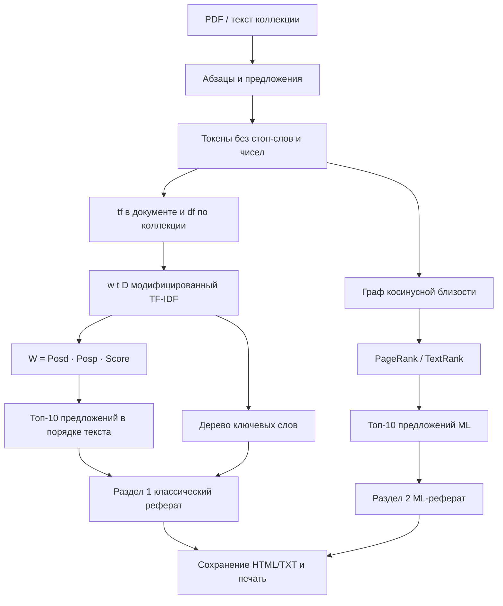

# Система автоматического реферирования (лабораторная работа 2, вариант 7)

## Цель проекта

Освоить на практике основные принципы автоматического реферирования документов: классический экстрактивный реферат, реферат в виде ключевых слов и реферат, построенный методами машинного обучения.

## Вариант 7


| Параметр           | Значение                                                    |
| ------------------ | ----------------------------------------------------------- |
| Языки              | французский, английский                                     |
| Методика           | Sentence extraction + ML                                    |
| Предметные области | научные статьи по computer science; сочинения по литературе |


Тестовая коллекция — восемь документов сопоставимого объёма (ориентир методички: ~10 страниц A4): по два англоязычных и два франкоязычных текста в каждой предметной области. При первом запуске система пытается загрузить статьи Wikipedia (это прямо допускается заданием) и сохранить их как PDF в `data/documents`. Если сети нет, подставляются встроенные эссе того же состава.

## Что система принимает и что выдаёт

На входе — текстовые PDF одинакового порядка длины. На выходе для каждого документа:

1. активная ссылка на исходный файл (`open` открывает PDF в браузере);
2. раздел 1 — классический реферат из 10 предложений (sentence extraction) и иерархический список ключевых слов;
3. раздел 2 — реферат TextRank (машинное обучение на графе предложений).

Реферат можно сохранить в TXT/HTML (`save`) и отправить на печать (`print`). Интерфейс — короткие команды и встроенная справка `help`.

## Структура системы

```
main.py                 точка входа, консоль, сохранение и печать
src/utils.py            токенизация EN/FR, стоп-слова, стемминг Snowball
src/document.py         Document, Sentence, частоты терминов, df по коллекции
src/extraction.py       Posd, Posp, модифицированный TF–IDF, вес предложения
src/keywords.py         униграммы и дерево именных групп
src/ml_summarizer.py    TextRank: TF–IDF sklearn + PageRank
src/metrics.py          ROUGE-1/2, Jaccard, покрытие ключевых слов
src/pipeline.py         загрузка → два реферата → оценка и графики
src/corpus.py           Wikipedia / запасные тексты, запись PDF
src/fallback_texts.py   офлайн-коллекция того же варианта
data/documents/         исходные PDF
data/raw/               кэш текстов Wikipedia
data/summaries/         сохранённые рефераты
data/quality_metrics.png
data/runtime.png
```

Пайплайн из `main`:

1. подгрузить ресурсы NLTK;
2. собрать коллекцию PDF одинакового размера;
3. разобрать абзацы и предложения, посчитать частоты терминов;
4. для выбранного документа посчитать веса sentence extraction и ранги TextRank;
5. показать или сохранить двухсекционный реферат; по команде `eval` сравнить методы.

## Формулы sentence extraction

Слова-числа и стоп-слова языка документа не учитываются. Для варианта 7 рабочий алфавит — латиница (английский и французский), поэтому латинские токены **не** отбрасываются: иначе словарь был бы пуст. Базовый вес термина в документе — схема TF–IDF в модификации Salton из методички.

### Положение предложения

Первое предложение документа и абзаца получает больший вес, последнее — меньший:

$$
\operatorname{Posd}(S_i)=1-\frac{BD(S_i)}{|D|},\qquad
\operatorname{Posp}(S_i)=1-\frac{BP(S_i)}{|P|}.
$$

$|D|$ — число символов в документе, $BD(S_i)$ — число символов до $S_i$ в документе, $|P|$ и $BP(S_i)$ — то же для абзаца.

### Модифицированный TF–IDF

$$
\operatorname{Score}(S_i)=\sum_{t\in S_i} tf(t,S_i)\cdot w(t,D),
$$

$$
w(t,D)=0.5\left(1+\frac{tf(t,D)}{tf_{\max}(D)}\right)\cdot\log\frac{|DB|}{df(t)}.
$$

$tf(t,S_i)$ — частота термина в предложении, $tf(t,D)$ — в документе, $tf_{\max}(D)$ — максимальная частота термина в $D$, $df(t)$ — число документов коллекции с термином $t$, $|DB|$ — размер коллекции.

### Итоговый вес и генерация

$$
W(S_i)=\operatorname{Posd}(S_i)\cdot\operatorname{Posp}(S_i)\cdot\operatorname{Score}(S_i).
$$

В реферат входят 10 предложений с наибольшим $W(S_i)$ **в порядке появления в тексте**. Короткие обрывки (меньше четырёх знаменательных слов) отфильтровываются. В начале предложения по возможности снимается вводная конструкция (`However,`, `Ainsi,`, `Dans cet article,` и т.п.).

### Ключевые слова

Униграммы ранжируются по $w(t,D)$. Словосочетания — устойчивые биграммы и триграммы знаменательных слов. Дерево строится как в методичке: голова → именные группы, где эта голова встречается (`intelligence` → `intelligence artificielle`).

## Алгоритм




## Структуры данных


| Объект           | Назначение                                                                                                                   |
| ---------------- | ---------------------------------------------------------------------------------------------------------------------------- |
| `Document`       | путь к PDF, язык, область, сырой текст, список `Sentence`, счётчик `term_frequencies`                                        |
| `Sentence`       | индекс, абзац, текст, смещения `start_char` / `paragraph_start`, стеммы, `posd`, `posp`, `tfidf_score`, `weight`, `ml_score` |
| `DOCUMENTS_DB`   | `id → Document`                                                                                                              |
| `TERM_DOC_COUNT` | `stem → df(t)` по коллекции                                                                                                  |
| `SummaryResult`  | дерево ключей, два списка предложений, время SE и ML                                                                         |
| TXT / HTML       | сериализованный выход для `save` и `print`                                                                                   |


Текст для анализа берётся из кэша `data/raw`, чтобы абзацы Wikipedia не ломались переносами PDF. PDF остаётся исходным документом для ссылки, просмотра и печати.

## Как работает машинное обучение

Классический метод задаёт вес предложения произведением трёх функций. ML-реферат строится иначе: **TextRank** (Mihalcea, Tarau). Предложения — вершины графа. Ребро — косинус между TF–IDF-векторами (`sklearn.TfidfVectorizer`). Ранг — итерации PageRank с затуханием 0.85. В реферат снова берутся 10 лучших предложений в порядке текста.

Так сравниваются две независимые процедуры отбора: локальные веса методички и коллективный ранг на графе. Обучать классификатор с учителем нельзя: у коллекции нет ручной разметки важных предложений, зато у статей Wikipedia есть человеческий лид (абзацы до первой секции) — его используем как эталон для ROUGE.

## Оценка качества

Команда `eval` считает для каждого документа:

- **ROUGE-1 / ROUGE-2** реферата относительно лида Wikipedia (для запасных текстов — относительно авторской аннотации);
- **Lead-10** как базовую линию «взять первые десять предложений»;
- **Jaccard** множеств предложений SE и ML;
- **покрытие ключевых слов** в каждом реферате;
- **время** построения SE и ML.

Метрики агрегируются по языку (EN/FR) и по области (CS / литература). Графики пишутся в `data/quality_metrics.png` и `data/runtime.png`.

Эталон для ROUGE — первые три абзаца лида Wikipedia (человеческая аннотация статьи). Lead-10 — базовый метод «взять начало документа».

### Результаты прогона коллекции

Все восемь PDF получились ровно по 10 страниц A4 (223–322 предложения).


| id  | Язык | Область     | N предл. | SE R-1   | ML R-1   | Lead-10 | Jaccard |
| --- | ---- | ----------- | -------- | -------- | -------- | ------- | ------- |
| 1   | EN   | CS          | 298      | 0.42     | 0.40     | 0.69    | 0.05    |
| 2   | EN   | CS          | 322      | 0.46     | 0.50     | 0.57    | 0.11    |
| 3   | EN   | литература  | 305      | 0.31     | 0.45     | 1.00    | 0.18    |
| 4   | EN   | литература  | 223      | 0.37     | 0.27     | 0.48    | 0.11    |
| 5   | FR   | CS          | 246      | 0.56     | 0.42     | 0.67    | 0.18    |
| 6   | FR   | CS          | 266      | 0.40     | 0.42     | 0.64    | 0.11    |
| 7   | FR   | литература  | 299      | 0.56     | 0.17     | 0.57    | 0.05    |
| 8   | FR   | литература  | 314      | 0.24     | 0.16     | 0.98    | 0.05    |
|     |      | **среднее** |          | **0.41** | **0.35** |         |         |


По языкам: EN SE=0.39 / ML=0.40; FR SE=0.44 / ML=0.29. По областям: CS SE=0.46 / ML=0.43; литература SE=0.37 / ML=0.26.

Время: sentence extraction ≈ 1.5 мс на документ, TextRank ≈ 6 мс (первый вызов sklearn дольше из‑за прогрева).

Как читать таблицу:

- Lead-10 часто выше SE/ML, потому что эталон — это как раз начало энциклопедической статьи. Методы задания ищут важные предложения **по всему** тексту, поэтому пересечение с лидом меньше, а тематическое покрытие (ключевые слова) остаётся высоким.
- Jaccard 0.05–0.18: два метода почти не выбирают одни и те же предложения — сравнение осмысленно.
- CS устойчивее литературы: термины повторяются, IDF и граф TextRank сходятся. В литературных статьях темы распределены, ML проседает сильнее, особенно на французском.
- Покрытие ключевых слов у обоих методов обычно 0.4–0.9, то есть реферат держит темы документа, даже когда ROUGE к лиду невысок.

## Используемые библиотеки

- **NLTK** — `sent_tokenize` (english/french), стоп-слова, `SnowballStemmer` для обоих языков;
- **PyMuPDF** — запись и (при необходимости) чтение PDF, шрифт DejaVu для диакритики;
- **NumPy** — итерации PageRank, массивы для графиков;
- **scikit-learn** — `TfidfVectorizer` и `cosine_similarity` в TextRank;
- **Matplotlib** — столбчатые диаграммы ROUGE, Jaccard, времени.

Готовые компоненты не заменяют формулы методички: веса $w(t,D)$, $\operatorname{Posd}$ и $\operatorname{Posp}$ считаются явно в `extraction.py`.

## Запуск

Из каталога `Lab 2`:

```bash
python -m venv .venv
source .venv/bin/activate
pip install -r requirements.txt
python main.py
```

Первый запуск качает Wikipedia (нужна сеть) и ресурсы NLTK. Повторные запуски читают `data/raw` и уже собранные PDF.

Из корня репозитория путь нужно брать в кавычки:

```bash
python "Lab 2/main.py" --eval
python "Lab 2/main.py" --id 1 --save
```

Полезные ключи:

```bash
python main.py --demo --no-interactive
python main.py --id 5
python main.py --eval
```

Интерактивные команды: `list`, `show`, `save`, `print`, `open`, `eval`, `help`, `quit`.

## Сравнение методов и выводы

Sentence extraction реализует задание буквально: произведение позиционных функций и модифицированного TF–IDF, генерация 10 предложений, дерево ключей. TextRank даёт второй раздел выхода и показывает, что графовый ранг не сводится к тем же предложениям (Jaccard обычно ниже 0.2).

Практический вывод по прогону: на научных статьях CS оба метода близки (средний ROUGE-1 около 0.45) и покрывают терминологию предметной области. На литературных текстах надёжнее sentence extraction, особенно для французского: позиция в абзаце и начале документа лучше ловит тезисы эссе, чем граф близости. Lead-10 выигрывает у обоих, если эталон — лид Wikipedia; это не ошибка системы, а свойство энциклопедического жанра. Для поиска тем внутри длинного документа полезнее пара «классический реферат + дерево ключей», а TextRank — как независимая вторая выборка предложений.

Перспектива: добавить сжатие анафор (замена местоимений на антецеденты) и запросно-ориентированный реферат — оба типа названы в методичке, но в варианте 7 не требовались.