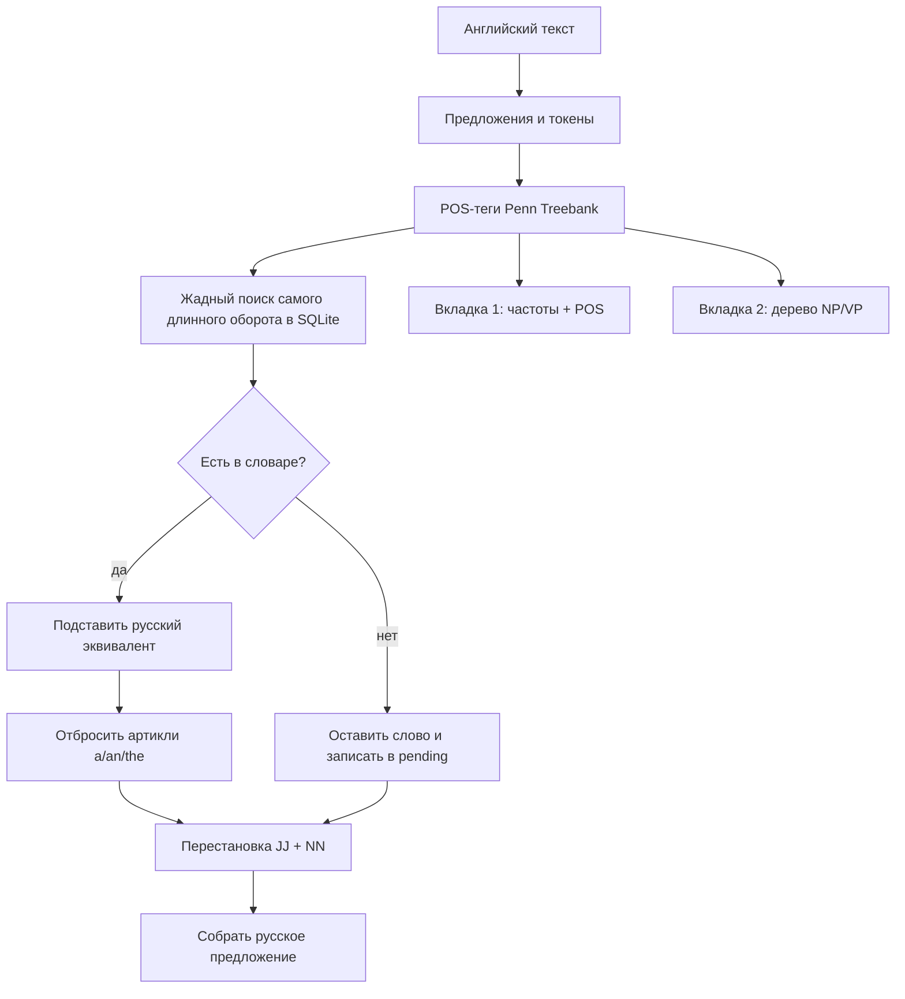

# Система машинного перевода (лабораторная работа 3, вариант 7)

## Цель проекта

Освоить на практике основные принципы машинного перевода документов: прямой пословно-оборотный перевод, учёт грамматики входного языка и ведение переводного словаря.

## Вариант 7

| Параметр | Значение |
|---|---|
| Направление | английский → русский |
| Предметные области | научные статьи по медицине; критика предметов изобразительного искусства |

Система относится к **прямому переводу** из классификации методички: единицы ищутся в словаре, подставляются русские соответствия, учитывается локальный контекст (устойчивые обороты до 4 слов). Добавлен минимальный трансфер: артикли отбрасываются, пара «прилагательное + существительное» переставляется ближе к русскому порядку.

## Что система принимает и что выдаёт

На входе — английский текст (документ коллекции или произвольная фраза). Система считает число слов и число единиц, найденных в словаре, и снимает POS-теги Penn Treebank с расшифровкой.

На выходе:

1. перевод на русский;
2. **вкладка 1** — слова, упорядоченные по частоте, с переводом и грамматикой;
3. **вкладка 2** — дерево синтаксического разбора выбранного предложения.

Словарь лежит в SQLite и пополняется командами `dict add` / `dict pending`. Результаты пишутся в TXT в кодировке UTF-8 и в HTML с двумя вкладками; `print` отправляет HTML на печать.

## Структура системы

```
main.py                 консоль, вкладки, словарь, сохранение и печать
src/utils.py            токенизация, POS, расшифровка тегов
src/lexicon.py          начальный англо-русский словарь областей варианта
src/dictionary.py       таблица SQLite `words` + очередь `pending`
src/translator.py       самый длинный оборот, трансфер, частоты
src/parser.py           RegexpParser: NP / PP / VP / CLAUSE
src/corpus.py           шесть английских текстов и PDF
src/pipeline.py         отчёты TXT/HTML и график покрытия
data/dictionary.sqlite  рабочий словарь
data/documents/         исходные TXT и PDF
data/translations/      сохранённые переводы
data/coverage.png
```

## Алгоритм перевода



1. Текст режется на предложения (`nltk.sent_tokenize`) и слова.
2. Каждому слову ставится POS-тег. Расшифровка тегов — словарь Penn Treebank в `utils.PENN_TAGS` (аналог грамматического модуля весенней лабораторной).
3. С позиции \(i\) система пробует 4-, 3-, 2-, затем 1-словные ключи в таблице `words`. Так переводятся обороты `clinical trial`, `blood pressure`, `art criticism`.
4. Артикли дают пустую подстановку. Если подряд идут JJ и NN, на русском они меняются местами (`clinical trial` уже является оборотом и не дробится).
5. Ненайденные слова остаются латиницей и накапливаются в `pending` для ручного пополнения словаря.

Это прямой перевод методички: нет полной синтаксической структуры как языка-посредника, есть только локальный контекст и словарь.

## Дерево разбора

Для вкладки 2 используется поверхностный chunking:

```
NP: {<DT|PRP$>?<JJ.*>*<NN.*>+}
PP: {<IN><NP>}
VP: {<MD>?<VB.*><RB>?<NP|PP|JJ.*>*}
CLAUSE: {<NP><VP>}
```

Дерево печатается в консоли и в HTML. Номер предложения задаётся вторым аргументом: `show 1 3`, `tab2 4 2`.

## Словарь как таблица БД

| Таблица | Назначение |
|---|---|
| `words(source, target, pos, updated_at)` | переводные соответствия |
| `pending(source, count)` | слова входа, которых ещё нет в `words` |

При первом запуске `words` заполняется посевом из `lexicon.py`. Дальше:

```
dict list vaccine
dict add myocardial wall = стенка миокарда NN
dict pending
dict del myocardial wall
```

`dict add` делает `INSERT … ON CONFLICT UPDATE`, поэтому той же командой можно **корректировать** перевод.

## Оценка

Команда `eval` считает покрытие словаря: доля входных слов, для которых найдено соответствие (артикли считаются переведёнными пустой формой). Сравнение идёт по документам, по медицине и по искусству. График — `data/coverage.png`.

Ожидаемо покрытие медицины и критики близко, если посев покрыл обе области; неизвестные слова — материал для `dict pending`. Качество самого русского текста у прямого перевода ниже, чем у нейронного МП: нет согласования падежа и рода. Это ограничение выбранного класса систем, а не сбой программы.

### Результаты прогона

Шесть документов, словарь из 655 единиц после посева.

| id | Область | Слов | Переведено | Покрытие |
|---:|---|---:|---:|---:|
| 1 | медицина | 182 | 176 | 97% |
| 2 | медицина | 164 | 158 | 96% |
| 3 | медицина | 182 | 177 | 97% |
| 4 | искусство | 201 | 192 | 96% |
| 5 | искусство | 200 | 192 | 96% |
| 6 | искусство | 207 | 197 | 95% |
| | **среднее** | | | **96%** |

Покрытие высокое, потому что посев заточен под тексты варианта. Неизвестные единицы (`when`, `even`, `uses`, `how`) попадают в `dict pending`. Русский выход читается как подстрочник: это ожидаемое поведение прямого МП.

## Запуск

Из каталога `Lab 3`:

```bash
python -m venv .venv
source .venv/bin/activate
pip install -r requirements.txt
python main.py
```

Из корня репозитория путь с пробелом нужно брать в кавычки:

```bash
"Lab 3/.venv/bin/python" "Lab 3/main.py"
"Lab 3/.venv/bin/python" "Lab 3/main.py" --eval
"Lab 3/.venv/bin/python" "Lab 3/main.py" --id 1 --save
"Lab 3/.venv/bin/python" "Lab 3/main.py" --text "The patient received a vaccine."
```

Интерактивные команды: `list`, `show`, `tab1`, `tab2`, `translate`, `dict`, `save`, `print`, `open`, `eval`, `help`, `quit`.

## Используемые библиотеки

- **NLTK** — сегментация предложений, POS-теггер, `RegexpParser` для дерева;
- **sqlite3** (стандартная библиотека) — словарь и очередь неизвестных слов;
- **PyMuPDF** — PDF коллекции для команды `open`;
- **Matplotlib** — столбцы покрытия.

Готовый теггер не заменяет словарь и алгоритм прямого перевода: соответствия и трансфер считаются явно.

## Предложения по улучшению

- морфологический синтез русского (падеж после предлога, согласование прилагательного);
- полноценный трансфер с синтаксическим деревом вместо локальной перестановки JJ–NN;
- отдельные словари медицины и искусства с пометкой области;
- статистический или нейросетевой МП как вторая вкладка для сравнения с прямым методом.
